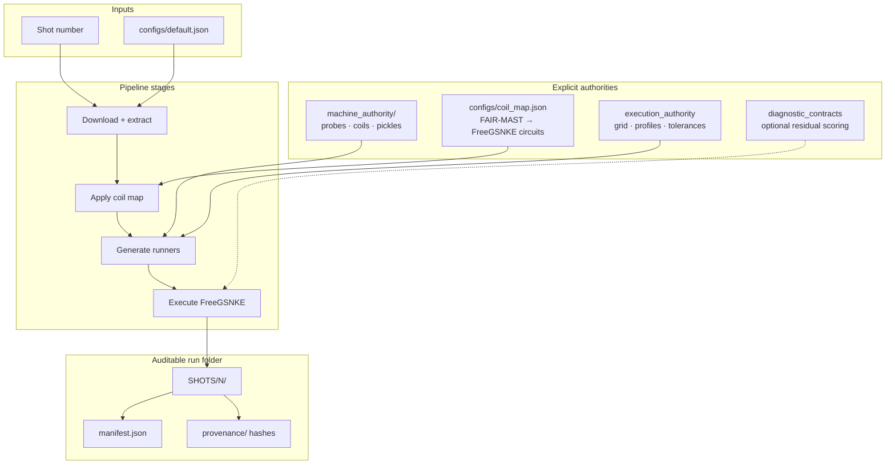
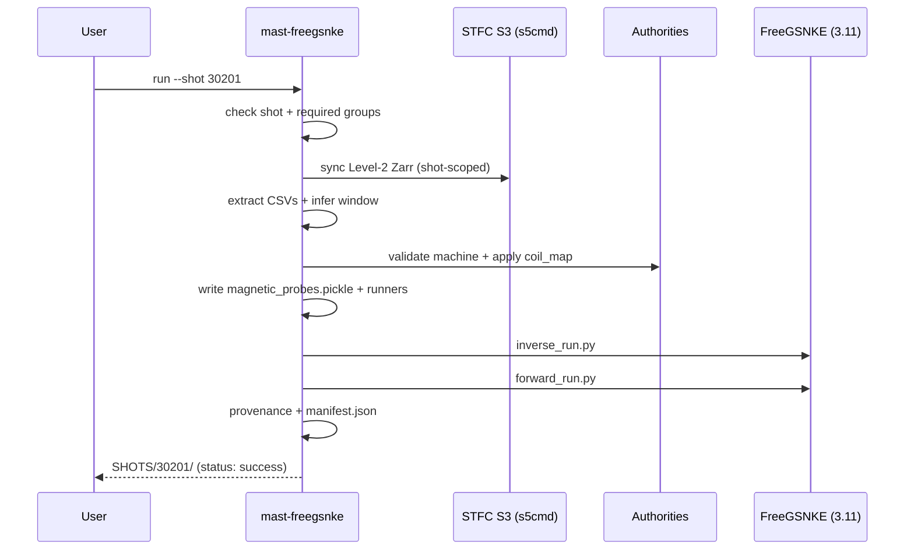

# Fair-MAST → FreeGSNKE Conversion Tool

**Version 10.1.3** · Deterministic reconstruction pipeline for MAST experimental data

Enter one or more **MAST shot numbers**. The pipeline downloads FAIR-MAST Level-2 data, builds FreeGSNKE inputs under explicit authorities, runs inverse and forward reconstructions, and writes a fully auditable folder under `SHOTS/<shot>/`.

```text
  shot number(s)  →  FAIR-MAST Level-2  →  FreeGSNKE inverse/forward  →  SHOTS/<N>/
```

**Author:** © 2026 Afshin Arjhangmehr

---

## What this tool does

| Stage | Action |
|-------|--------|
| Discover | Verify the shot exists and required Level-2 groups are present |
| Download | Sync FAIR-MAST Zarr data via `s5cmd` (STFC public S3) |
| Extract | Export PF currents, magnetics, and related CSVs |
| Window | Infer a formed-plasma time window (overrideable, logged) |
| Authority | Apply machine geometry, coil map, and execution numerics |
| Generate | Emit `inverse_run.py`, `forward_run.py`, and probe pickles |
| Execute | Optionally run FreeGSNKE and capture logs + solver evidence |
| Provenance | Hash artifacts, snapshot authorities, write `manifest.json` |

### Design principles

1. **Determinism** — no hidden optimization, smoothing, or silent conventions  
2. **Explicit authority** — machine, coil map, contracts, and numerics are declared JSON (snapshotted and hashed)  
3. **Fail fast** — missing or template metrology blocks the run; geometry is never invented  
4. **One mapping path** — `configs/coil_map.json` drives PF currents; heuristics are suggest-only  
5. **Manifest everything** — every stage outcome is recorded for replay and review  

---

## End-to-end data flow


---

## Authority model

Reconstruction inputs are never inferred silently. Each authority is versioned, validated, and copied into the run folder.



| Authority | Role | Shipped default |
|-----------|------|-----------------|
| `machine_authority/` | Probe/coil geometry + FreeGSNKE structural pickles | Built from FAIR-MAST Level-2 + FreeGSNKE MAST-U-like machine |
| `configs/coil_map.json` | Maps Level-2 `current_channel` labels to FreeGSNKE circuits | FAIR-MAST channels (`SOL`, `P2IL FEED`, …) with explicit `sum` |
| Execution authority | Grid, profile basis, solver tolerances | Generated per run under `inputs/execution_authority/` |
| Diagnostic contracts | Experimental ↔ synthetic comparison | Optional (`enable_contract_metrics`) |

> Template or `CHANGE_ME` machine authority is **rejected**. Metrology must come from FAIR-MAST or an authoritative machine definition.

---

## Quick start

### Prerequisites

| Requirement | Notes |
|-------------|-------|
| Python **3.9+** | Pipeline package |
| Python **3.11** venv | FreeGSNKE (3.14 often lacks compatible SciPy wheels) |
| `s5cmd` | On `PATH`, or at `tools/s5cmd.exe` |

### 1. Install the pipeline

```bash
python -m venv .venv
# Windows:  .venv\Scripts\activate
# Linux/macOS: source .venv/bin/activate

pip install -e ".[zarr,dev]"
```

### 2. Install FreeGSNKE (one-time)

```bash
# Windows example — use Python 3.11
py -3.11 -m venv .venv-freegsnke
.venv-freegsnke\Scripts\python -m pip install -r requirements-freegsnke.txt
```

`configs/default.json` already points `freegsnke_python` at `.venv-freegsnke/Scripts/python.exe`. Adjust the path on Linux/macOS.

### 3. Ensure `s5cmd`

```bash
python scripts/ensure_s5cmd.py
# or place s5cmd on PATH / set s5cmd_path in config
```

### 4. Run (shot number only)

**Interactive (recommended):**

```bat
run_pipeline.cmd
```

```bash
./run_pipeline.sh
```

**CLI:**

```bash
python -m mast_freegsnke.cli doctor --config configs/default.json
python -m mast_freegsnke.cli run --shot 30201 --config configs/default.json
```

Doctor should report OK for s5cmd, machine authority, coil map, and FreeGSNKE before a full run.

---

## Pipeline stages (detail)



---

## Run folder layout

```text
SHOTS/30201/
├── inputs/                      # CSVs, window, execution authority
├── machine_authority_snapshot/  # hashed copy of machine authority
├── magnetic_probes.pickle       # FreeGSNKE-native probe dict
├── inverse_run.py
├── forward_run.py
├── logs/                        # FreeGSNKE stdout/stderr
├── solver_introspection/        # solver state + default-detection
├── provenance/                  # hashes, env fingerprint, manifest_v2
├── contracts/                   # resolved contracts (if enabled)
├── metrics/                     # residual scores (if enabled)
└── manifest.json                # stage outcomes (source of truth)
```

Export a self-contained reviewer bundle:

```bash
mast-freegsnke reviewer-pack --run SHOTS/30201
```

---

## Configuration

Canonical config: [`configs/default.json`](configs/default.json)

| Key | Purpose |
|-----|---------|
| `level2_s3_prefix` | `s3://mast/level2/shots` |
| `s3_endpoint_url` | `https://s3.echo.stfc.ac.uk` |
| `s3_no_sign_request` | `true` for public Level-2 |
| `machine_authority_dir` | `machine_authority` |
| `coil_map_path` | `configs/coil_map.json` |
| `execute_freegsnke` | `true` / `false` |
| `freegsnke_run_mode` | `inverse` · `forward` · `both` |
| `freegsnke_python` | Path to FreeGSNKE Python 3.11 interpreter |

Rebuild machine authority from a cached shot (when refreshing geometry):

```bash
python scripts/build_authority_from_fairmast.py \
  --shot-cache data_cache/shot_30201 --out machine_authority --shot 30201
python scripts/fetch_freegsnke_machine.py
```

---

## CLI reference

```bash
mast-freegsnke doctor              # environment + authority health
mast-freegsnke check --shot N      # shot + Level-2 group availability
mast-freegsnke run --shot N        # full pipeline
mast-freegsnke machine-validate    # machine authority
mast-freegsnke coilmap-validate    # coil map
mast-freegsnke contracts-validate  # diagnostic contracts
mast-freegsnke reviewer-pack       # export REVIEWER_PACK/
mast-freegsnke replay-run          # hash-verified replay (v8)
```

Advanced workflows (robustness DOE, physics audit, atlas compare, forensics) are documented under [`examples/`](examples/) and [`CHANGELOG.md`](CHANGELOG.md).

---

## Repository layout

```text
├── configs/                 # default.json, coil_map.json, examples
├── machine_authority/       # probe/coil geometry + FreeGSNKE pickles
├── src/mast_freegsnke/      # pipeline package
├── scripts/                 # authority build, s5cmd helper, fetch machine
├── templates/               # FreeGSNKE runner templates
├── examples/                # progressive walkthroughs
├── tests/
├── run_pipeline.cmd /.sh    # interactive shot-only launcher
└── requirements-freegsnke.txt
```

---

## Troubleshooting

| Symptom | Fix |
|---------|-----|
| `s5cmd` not found | `python scripts/ensure_s5cmd.py` or set `s5cmd_path` |
| FreeGSNKE import / SciPy build fails | Use a **Python 3.11** venv; point `freegsnke_python` at it |
| Machine authority rejected | Rebuild from FAIR-MAST; templates with `CHANGE_ME` are fail-closed |
| Empty download | Confirm endpoint/prefix; doctor runs shot-scoped S3 preflight |
| Run failure | Attach `SHOTS/<N>/EXCEPTION_TRACEBACK.txt` and `logs/run_*.log` |

---

## Reproducibility

Each run records:

- Stage outcomes in `manifest.json`
- SHA-256 artifact hashes under `provenance/`
- Environment fingerprint and `pip freeze`
- Snapshotted machine authority and execution numerics

Cite this repository and include the run’s `manifest.json`, authorities, and contracts in derived publications.

---

## License & citation

See repository license terms. Package version: **10.1.3**.

Full history: [`CHANGELOG.md`](CHANGELOG.md)
