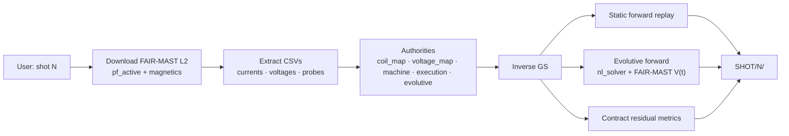
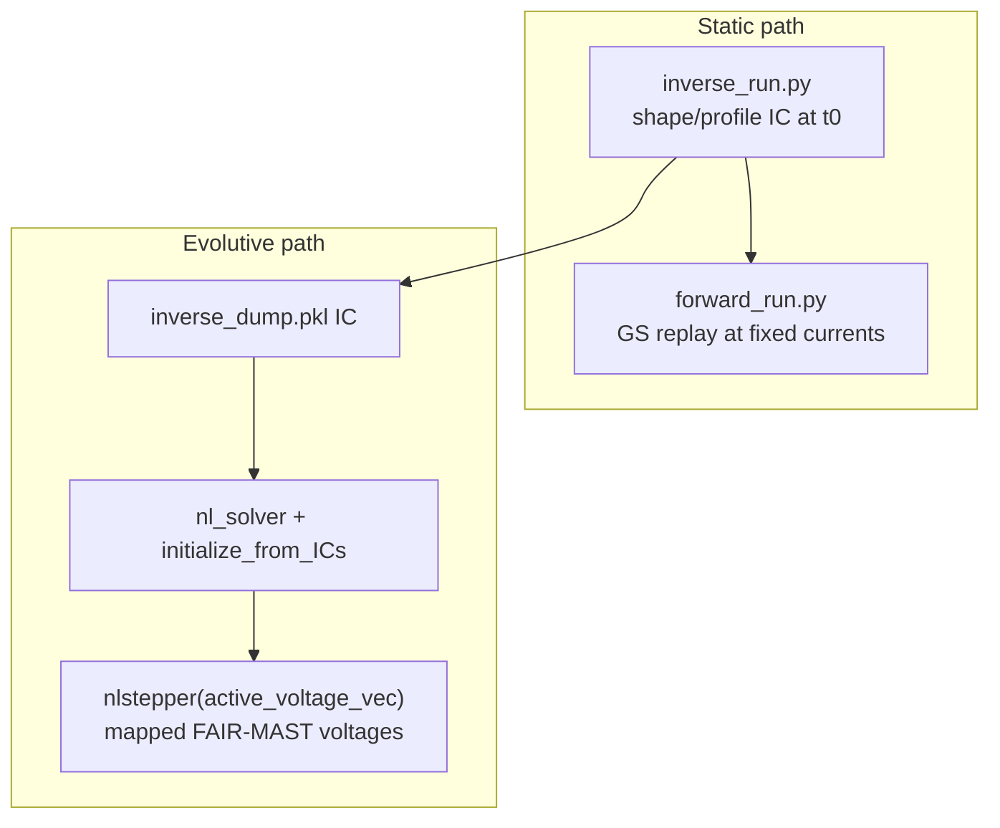
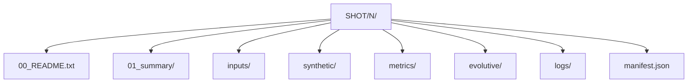

# fair-mast-freegsnke

**Shot-only** FAIR-MAST Level-2 → FreeGSNKE: static inverse/forward **and** evolutive forward, under explicit authorities, with residual metrics and full provenance.

Enter one or more **MAST shot numbers**. Everything else is automatic.

```text
shot number(s)  →  FAIR-MAST Level-2  →  FreeGSNKE inverse/forward/evolutive  →  SHOT/<N>/
```

Upstream references:

- [FAIR-MAST](https://github.com/ukaea/fair-mast) — Level-2 Zarr (currents + `coil_voltage` in V)
- [FreeGSNKE](https://github.com/FusionComputingLab/freegsnke) — Grad–Shafranov + evolutive `nl_solver` / `nlstepper`

Version **11.0.0**.

---

## Quick start (shot number only)

```bash
# Windows
run_pipeline.cmd
# prompts ONLY for shot number(s)

# Non-interactive
mast-freegsnke run --shot 30201 --config configs/default.json
```

Requirements: Python 3.11+, `s5cmd`, FreeGSNKE in `.venv-freegsnke`, pipeline package in `.venv`.

```bash
mast-freegsnke doctor --config configs/default.json
```

---

## Data flow



### Static vs evolutive



---

## Authority model

| Authority | Role |
|-----------|------|
| `machine_authority/` | FreeGSNKE pickles + FAIR-MAST probe geometry (no invented metrology) |
| `configs/coil_map.json` | Current channels → FreeGSNKE circuits (binding) |
| `configs/voltage_map.json` | Voltage channels → active vector order (binding; missing circuits declare `default_V=0`) |
| `execution_authority` | Grid, profiles, boundary, solver, metrics timebase |
| `configs/evolutive_authority.json` | `dt`, `n_steps`, `linear_only`, `plasma_resistivity`, timeouts |
| `diagnostic_contracts.json` | Residual scoring pairs |
| `diagnostic_calibration.json` | Optional V→T / V→Wb (empty until real factors exist) |

**Design laws:** determinism · explicit authority · fail fast · never invent geometry/voltages/profiles · one binding mapping path · manifest everything.

---

## Output layout (`SHOT/<N>/`)

Operational paths stay at the run root (stable for tooling). An expert-facing index is added on top:

```text
SHOT/30201/
  00_README.txt                 # human index
  01_summary/
    SUMMARY.md / SUMMARY.json   # status, window, modes, metrics, limits
    timeline.txt
  inputs/                       # experimental CSVs + authority snapshots
  synthetic/                    # FreeGSNKE probe synthetics
  metrics/                      # residual scores
  evolutive/                    # history.csv, snapshots, meta
  logs/
  manifest.json
  inverse_run.py / forward_run.py / evolutive_run.py
  inverse_dump.pkl
```



Legacy `SHOTS/` is still ignored by git if present; default `runs_dir` is now **`SHOT`**.

---

## Honest limitations

- Structural machine is **MAST-U-like** FreeGSNKE pickles; classic MAST FAIR-MAST voltages (`p1`/`p2`/`p4`/`p5`) are mapped explicitly (`p1→Solenoid`, `p2→PX`, `p4→P4`, `p5→P5`).
- Circuits without Level-2 voltage channels use **declared** `default_V=0` (zero-drive), not silent inventing.
- Evolutive profile parameters (`alpha_m`/`alpha_n`/…) are **held from the inverse IC** unless FAIR-MAST provides them (they do not invent them).
- Mirnov/saddle/omaha stay audit-only until a real calibration authority is populated.

---

## Install

```bash
python -m venv .venv
.venv\Scripts\activate          # Windows
pip install -e ".[dev,zarr]"

# FreeGSNKE (separate venv recommended)
python3.11 -m venv .venv-freegsnke
.venv-freegsnke\Scripts\pip install freegsnke
```

Set `freegsnke_python` in `configs/default.json` if needed.

---

## License / authorship

© 2026 Afshin Arjhangmehr. See repository LICENSE if present.
