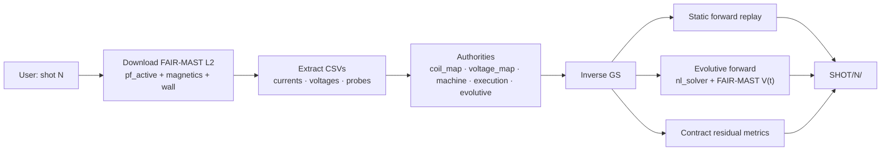
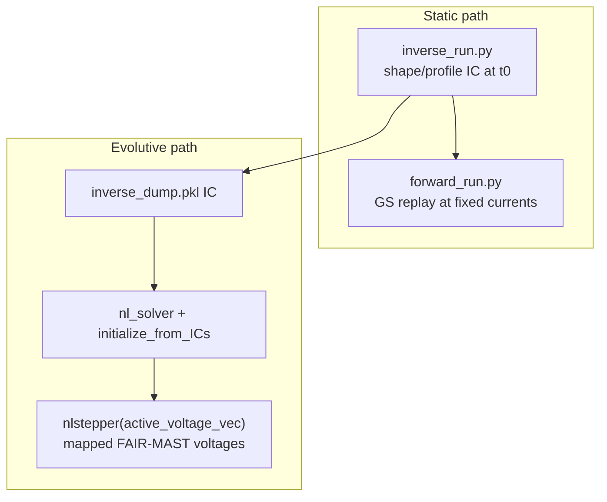
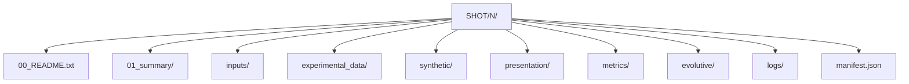

# fair-mast-freegsnke

**Shot-only** FAIR-MAST Level-2 → FreeGSNKE: static inverse/forward **and** evolutive forward, under explicit authorities, with residual metrics and full provenance.

Enter one or more **MAST shot numbers**. Everything else is automatic.

```text
shot number(s)  →  FAIR-MAST Level-2  →  FreeGSNKE inverse/forward/evolutive  →  SHOT/<N>/
```

Upstream references:

- [FAIR-MAST](https://github.com/ukaea/fair-mast) — Level-2 Zarr (currents + `coil_voltage` in V)
- [FreeGSNKE](https://github.com/FusionComputingLab/freegsnke) — Grad–Shafranov + evolutive `nl_solver` / `nlstepper`

Version **11.6.1**.

---

## Quick start (shot number only)

```bash
# Windows
run_pipeline.cmd
# prompts ONLY for shot number(s)

# Non-interactive
mast-freegsnke run --shot 30201 --config configs/default.json
```

Requirements: Python 3.11+, `s5cmd`, FreeGSNKE in `.venv-freegsnke`, pipeline package in `.venv`.

```bash
mast-freegsnke doctor --config configs/default.json
```

---

## Data flow



### Static vs evolutive



---

## Authority model

| Authority | Role |
|-----------|------|
| `machine_authority/` | Classic MAST FreeGSNKE pickles from FAIR-MAST Level-2 filaments + `wall.zarr` EFIT limiter; auto-rebuild on fingerprint change; probe geometry JSON (no invented metrology) |
| `configs/coil_map.json` | Current channels → classic circuits (`mean` for series P2–P5/P3; `antisym_mean` `[P6U,P6L]` → `0.5*(P6U-P6L)` for anti-series P6) |
| `configs/voltage_map.json` | Voltage channels → classic active vector (measured FAIR-MAST V primary; `from_current_ohmic` for P3/P6; no divertors) |
| `configs/l1_voltage_inventory_30201.json` | Declared L1/L2 inventory: no usable P3/P6 PF drive voltage on public FAIR-MAST |
| `configs/passive_resistivity.json` | Awaiting cited ρ for FreeGSNKE passives (pf_passive geometry alone is not enough) |
| `execution_authority` | Grid, profiles, boundary, solver, metrics timebase |
| `configs/evolutive_authority.json` | `dt`, `cover_window`/`max_steps`, `linear_only`, `scale_paxis_with_ip`, resistivity, timeouts |
| `diagnostic_contracts.json` | Residual scoring pairs |
| `diagnostic_calibration.json` | Optional V→T / V→Wb (empty until real factors exist) |

**Design laws:** determinism · explicit authority · fail fast · never invent geometry/voltages/profiles · one binding mapping path · manifest everything.

---

## Output layout (`SHOT/<N>/`)

Operational paths stay at the run root (stable for tooling). An expert-facing index is added on top:

```text
SHOT/30201/
  00_README.txt                 # human index
  01_summary/
    SUMMARY.md / SUMMARY.json   # status, window, modes, metrics, limits
    timeline.txt
  inputs/                       # experimental CSVs + authority snapshots
  experimental_data/            # categorized FAIR-MAST CSV + professional plots
  synthetic/                    # FreeGSNKE probe synthetics
  presentation/                 # inverse/forward eq frames + GIFs
  metrics/                      # residual scores
  evolutive/                    # history.csv, snapshots, evolutive_equilibria.gif
  logs/
  manifest.json
  inverse_run.py / forward_run.py / evolutive_run.py
  inverse_dump.pkl
```

Formed-plasma window samples (`metrics_n_times`, default 5) drive **inverse** and **forward** equilibria GIFs; evolutive steps drive `evolutive/evolutive_equilibria.gif`. Toggle via `write_equilibrium_gifs` in `configs/default.json`.



Legacy `SHOTS/` is still ignored by git if present; default `runs_dir` is now **`SHOT`**.

---

## Honest limitations

- **FAIR-MAST = classic MAST** (not MAST-U). Structural machine pickles are built from Level-2 PF filaments (`scripts/build_classic_mast_machine.py`).
- Measured voltages `p1`/`p2`/`p4`/`p5` (V) drive Solenoid / P2_inner+P2_outer (same-V) / P4 / P5. **P3/P6**: public L1/L2 have no usable measured PF drive V (inventory `configs/l1_voltage_inventory_30201.json`; `xma/p6_volts` is not usable) → `from_current_ohmic` (`V=I×R` only).
- **Limiter/wall** = FAIR-MAST `wall.zarr` `limiter_r`/`limiter_z` (EFIT limiter geometry) — **≠ surveyed CAD vessel**, and not a flux-loop proxy.
- **No FreeGSNKE passives**: Level-2 `pf_passive` has parallelogram geometry but **no resistivity**; inventing ρ is forbidden → empty `passive_coils.pickle`.
- Active-coil **resistivity** = FreeGSNKE copper default **1.55e-8** (declared material constant; Level-2 does not publish coil ρ).
- Evolutive profiles: `alpha_m`/`alpha_n`/`fvac` held from inverse IC; optional `scale_paxis_with_ip` is a declared Ip scaling law (default off).
- Mirnov/saddle/omaha stay audit-only until a real calibration authority is populated.

---

## Install

```bash
# Quickest (Windows): clones + bootstraps s5cmd + FreeGSNKE venv automatically
run_pipeline.cmd
# Enter shot number only (e.g. 30201)

# Or manual:
python -m venv .venv
.venv\Scripts\activate          # Windows
pip install -e ".[dev,zarr]"
python scripts/ensure_s5cmd.py
python scripts/ensure_freegsnke_env.py   # creates .venv-freegsnke + installs freegsnke
```

`configs/default.json` expects `.venv-freegsnke` (set `freegsnke_python` if you use another env).

---

## License / authorship

© 2026 Afshin Arjhangmehr. See repository LICENSE if present.
