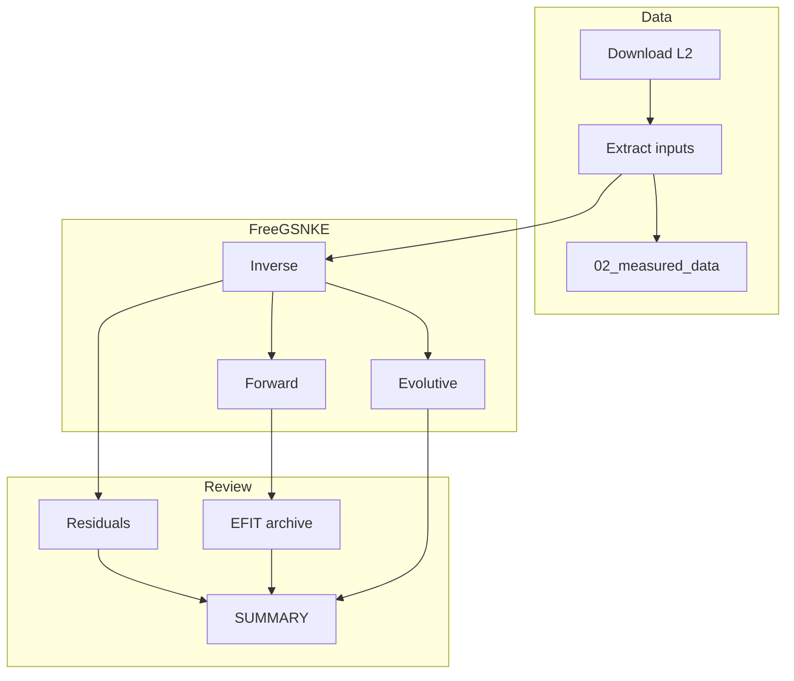
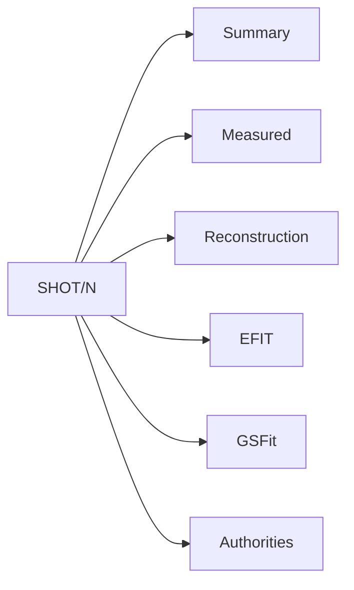
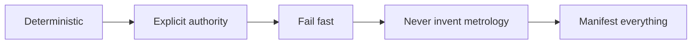

# Fair-MAST → FreeGSNKE

**Enter a MAST shot number. Everything else is automatic.**

Classic MAST Level-2 data → FreeGSNKE equilibrium reconstruction → residuals, plots, and provenance under `SHOT/<N>/`.

| | |
|---|---|
| **Version** | **11.30.0** |
| **Machine** | Classic MAST (not MAST-U) |
| **Solver** | [FreeGSNKE](https://github.com/FusionComputingLab/freegsnke) only |
| **EFIT** | Archive compare (ADR-002) — not live EFIT++ / Py-EFIT / efit-ai |
| **GSFit** | Optional live peer (ADR-006) — soft-skips until calib + Green’s cited |


```mermaid
flowchart LR
  shot([Shot N]) --> l2[FAIR-MAST L2]
  l2 --> auth[Authorities]
  auth --> solve[FreeGSNKE]
  solve --> out([SHOT/N pack])
```

---

## Quick start

**Windows**

```bat
git clone https://github.com/afshin-arj/Fair-MAST-to-FreeGSNKE-Conversion-tool.git
cd Fair-MAST-to-FreeGSNKE-Conversion-tool
setup_fresh.cmd
run_pipeline.cmd
run_ui.cmd
```

**Linux / macOS**

```bash
git clone https://github.com/afshin-arj/Fair-MAST-to-FreeGSNKE-Conversion-tool.git
cd Fair-MAST-to-FreeGSNKE-Conversion-tool
chmod +x setup_fresh.sh run_pipeline.sh
./setup_fresh.sh
./run_pipeline.sh
```

Requires **Python 3.11**. Happy path prompts **only** for the shot number.

```bash
mast-freegsnke doctor --config configs/default.json
mast-freegsnke run --shot 30201 --config configs/default.json
mast-freegsnke ui --config configs/default.json
```

---

## Pipeline


```mermaid
flowchart TB
  subgraph data [Data]
    dl[Download L2]
    ex[Extract inputs]
    meas[02_measured_data]
  end
  subgraph freeg [FreeGSNKE]
    inv[Inverse]
    fwd[Forward]
    evo[Evolutive]
  end
  subgraph review [Review]
    met[Residuals]
    efit[EFIT archive]
    sum[SUMMARY]
  end
  dl --> ex --> meas
  ex --> inv --> fwd
  inv --> evo
  inv --> met --> sum
  fwd --> efit --> sum
  evo --> sum
```

| Stage | What it does |
|-------|----------------|
| **Inverse** | Static GS with declared shape targets; shape gate ≠ FreeGSNKE GS stop |
| **Forward** | Dump-current t0 + measured-PF window; live LCFS; ≠ Inverse DN |
| **Evolutive** | nlstepper from Inverse IC + voltages; live LCFS; soft-stop honesty |
| **EFIT compare** | FreeGSNKE vs archived FAIR-MAST EFIT++ |
| **GSFit peer** | Optional live fit (ADR-006); soft-skips while awaiting |

---

## Output pack

```text
SHOT/<N>/
├── 00_START_HERE.txt
├── 01_summary/          SUMMARY · science audit
├── 02_measured_data/    Level-2 CSV + plots
├── 03_reconstruction/   metrics · GIFs · evolutive
├── 04_efit_compare/     vs EFIT++ archive
├── 06_authorities/      snapshotted JSON + hashes
├── 07_planner/          optional GSPulse-method planner
├── 08_gsfit/            GSFit live peer (ADR-006; often awaiting)
└── manifest.json
```


```mermaid
flowchart LR
  pack[SHOT/N] --> s[Summary]
  pack --> m[Measured]
  pack --> r[Reconstruction]
  pack --> e[EFIT]
  pack --> g[GSFit]
  pack --> a[Authorities]
```

---

## Design laws


```mermaid
flowchart LR
  d[Deterministic] --> a[Explicit authority]
  a --> f[Fail fast]
  f --> n[Never invent metrology]
  n --> m[Manifest everything]
```

- Coil maps, voltages, machine, and solver knobs are **declared JSON** (hashed).
- Missing authority **blocks** the run — no silent defaults that invent geometry or calibration.
- Browser UI: `run_ui.cmd` → `http://127.0.0.1:8050`

---

## Honest limits

- Classic MAST only · no FreeGSNKE passives until cited ρ exists  
- P3/P6 use declared `I×R` ohmic drive (no public PF V)  
- EFIT tab = archive compare, not a live reconstruction engine
- GSFit tab = live peer scaffold (ADR-006); awaiting until calib + Green’s cited
- Planner (`07_planner/`, GSPulse-method Python) never invents passives/ρ — YELLOW until cited resistivity  

---

## Docs

| | |
|---|---|
| `AGENTS.md` | North star + agent roles |
| `docs/adr/` | Architecture decisions |
| [FAIR-MAST](https://github.com/ukaea/fair-mast) · [mastapp L2](https://mastapp.site/level2-data.html) | Upstream data |

© 2026 Afshin Arjhangmehr
