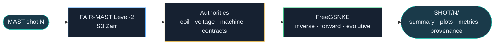
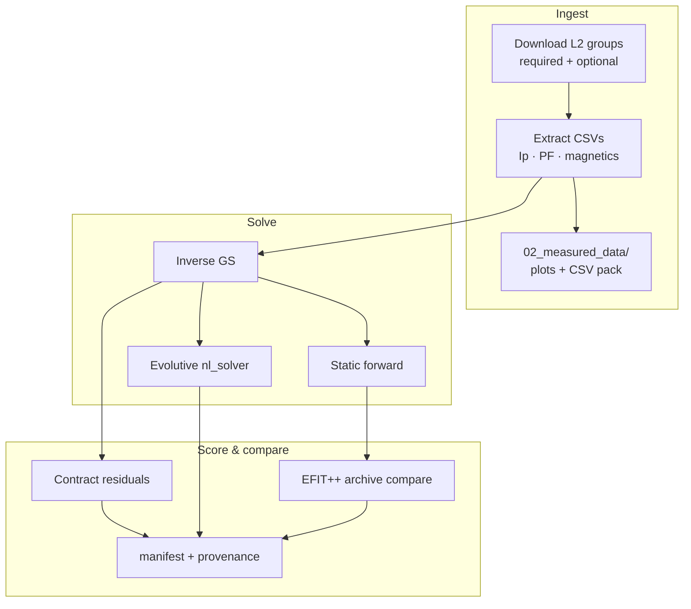
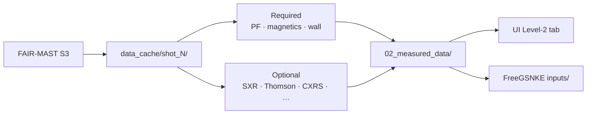
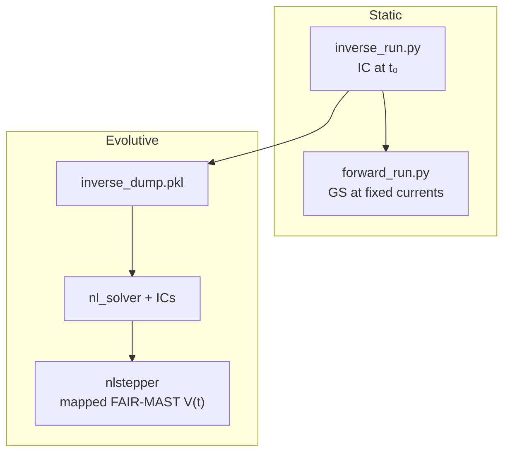
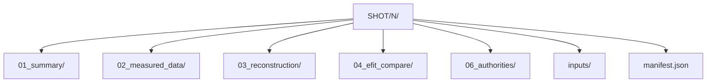
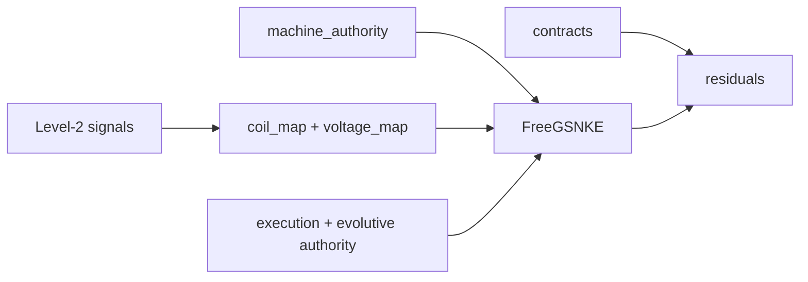

# Fair-MAST → FreeGSNKE

**Enter a MAST shot number. Everything else is automatic.**

This toolkit downloads [FAIR-MAST](https://github.com/ukaea/fair-mast) Level-2 data, builds FreeGSNKE inputs under **explicit authorities**, runs static inverse / forward and evolutive reconstruction, scores diagnostic residuals, and writes a full provenance pack under `SHOT/<N>/`.

| | |
|---|---|
| **Happy path** | One shot number → download → reconstruct → metrics → provenance |
| **Machine** | Classic MAST (not MAST-U) |
| **Solver** | [FreeGSNKE](https://github.com/FusionComputingLab/freegsnke) only |
| **EFIT insight** | Compare to archived FAIR-MAST EFIT++ (not a live EFIT++ / Py-EFIT / efit-ai run) |
| **Version** | **11.10.0** |


```mermaid
flowchart LR
  A(["MAST shot N"]) --> B["FAIR-MAST Level-2<br/>S3 Zarr"]
  B --> C["Authorities<br/>coil · voltage · machine · contracts"]
  C --> D["FreeGSNKE<br/>inverse · forward · evolutive"]
  D --> E(["SHOT/N/<br/>summary · plots · metrics · provenance"])

  style A fill:#1a3a4a,stroke:#2ec4b3,color:#eaf0f7
  style E fill:#1a3a4a,stroke:#2ec4b3,color:#eaf0f7
  style B fill:#162131,stroke:#5eb0ff,color:#eaf0f7
  style C fill:#162131,stroke:#e8b84a,color:#eaf0f7
  style D fill:#162131,stroke:#3dd68c,color:#eaf0f7
```

---

## Why this exists

Fusion equilibrium work should be **repeatable and honest**:

- **Deterministic** — no hidden smoothing or silent heuristics
- **Authority-driven** — coil maps, voltages, machine geometry, and numerics are declared JSON (snapshotted + hashed)
- **Fail-fast** — missing authority blocks the run; optional diagnostics only warn
- **Never invent metrology** — no fake probe calibrations, Green’s tables, or vessel CAD

Upstream data: [mastapp Level-2 catalog](https://mastapp.site/level2-data.html) · [FAIR-MAST](https://github.com/ukaea/fair-mast) · [FreeGSNKE](https://github.com/FusionComputingLab/freegsnke)

---

## Quick start

### Windows (recommended)

```bat
git clone https://github.com/afshin-arj/Fair-MAST-to-FreeGSNKE-Conversion-tool.git
cd Fair-MAST-to-FreeGSNKE-Conversion-tool

setup_fresh.cmd          REM once: venv + deps + s5cmd (+ FreeGSNKE helper)
run_pipeline.cmd         REM prompts ONLY for shot number(s)
run_ui.cmd               REM optional browser console → http://127.0.0.1:8050
```

### Non-interactive

```bash
mast-freegsnke doctor --config configs/default.json
mast-freegsnke run --shot 30201 --config configs/default.json
mast-freegsnke ui --config configs/default.json
```

### Manual install

```bash
py -3.11 -m venv .venv
.venv\Scripts\activate          # Windows
pip install -U pip
pip install -r requirements.txt
pip install -e ".[ui]"
python scripts/ensure_s5cmd.py
python scripts/ensure_freegsnke_env.py
```

**Requirements:** Python 3.11+, network access to FAIR-MAST S3 (`s5cmd`), FreeGSNKE in `.venv-freegsnke` when `execute_freegsnke=true`.

After a run, open `SHOT/<N>/00_START_HERE.txt` (or `01_summary/SUMMARY.md`).

---

## What you get


```mermaid
flowchart TB
  subgraph ingest [Ingest]
    DL["Download L2 groups<br/>required + optional"]
    EX["Extract CSVs<br/>Ip · PF · magnetics"]
    MEAS["02_measured_data/<br/>plots + CSV pack"]
  end
  subgraph solve [Solve]
    INV["Inverse GS"]
    FWD["Static forward"]
    EVO["Evolutive nl_solver"]
  end
  subgraph score [Score & compare]
    MET["Contract residuals"]
    EFIT["EFIT++ archive compare"]
    PROV["manifest + provenance"]
  end

  DL --> EX --> MEAS
  EX --> INV --> FWD
  INV --> EVO
  INV --> MET
  FWD --> EFIT
  MET --> PROV
  EVO --> PROV
  EFIT --> PROV
```

| Path | Purpose |
|------|---------|
| **CLI** | `mast-freegsnke run --shot <N>` — shot-only automation |
| **UI** | Live stages, Level-2 browser, residuals, EFIT, ZIP download |
| **Cache** | `data_cache/shot_<N>/` — existing Zarr groups are **reused** (only missing groups sync) |

---

## Level-2 data

**Required** (blocking if missing): `pf_active`, `magnetics`, `wall`

**Optional** (warn if missing — never invent):

| Group | Typical content |
|-------|-----------------|
| `summary` | General 1-D physics profiles |
| `pulse_schedule` | Planned Ip / line density |
| `spectrometer_visible` | Dα / BES |
| `soft_x_rays` | Soft X-ray cameras |
| `thomson_scattering` | Te, ne, pe (+ core traces) |
| `charge_exchange` | Ti, Vi (CXRS) |
| `gas_injection` | Gas valves / pressure |
| `equilibrium` | Archived EFIT++ fields (also used for compare) |
| `pf_passive` | Passive geometry (no ρ → no FreeGSNKE passives) |

Exported under `SHOT/<N>/02_measured_data/` as CSV + PNG, browsable in the UI **Level-2** tab (click-to-expand families).


```mermaid
flowchart LR
  S3["FAIR-MAST S3"] --> CACHE["data_cache/shot_N/"]
  CACHE --> REQ["Required<br/>PF · magnetics · wall"]
  CACHE --> OPT["Optional<br/>SXR · Thomson · CXRS · …"]
  REQ --> PACK["02_measured_data/"]
  OPT --> PACK
  PACK --> UI["UI Level-2 tab"]
  PACK --> FG["FreeGSNKE inputs/"]
```

---

## Reconstruction paths


```mermaid
flowchart TB
  subgraph static [Static]
    I1["inverse_run.py<br/>IC at t₀"]
    F1["forward_run.py<br/>GS at fixed currents"]
    I1 --> F1
  end
  subgraph evolutive [Evolutive]
    IC["inverse_dump.pkl"]
    NL["nl_solver + ICs"]
    ST["nlstepper<br/>mapped FAIR-MAST V(t)"]
    IC --> NL --> ST
  end
  I1 --> IC
```

Formed-plasma window samples drive inverse/forward GIFs; evolutive steps drive `evolutive_equilibria.gif` (toggles in `configs/default.json`).

---

## Output layout

```text
SHOT/30201/
├── 00_START_HERE.txt / 00_README.txt
├── 01_summary/           SUMMARY.md · SUMMARY.json · timeline
├── 02_measured_data/     Level-2 plots + CSV (plasma…Thomson…CXRS…)
├── 03_reconstruction/    scripts · metrics · presentation GIFs · evolutive
├── 04_efit_compare/      FreeGSNKE vs FAIR-MAST EFIT++ archive
├── 06_authorities/       snapshotted JSON + hashes
├── inputs/               tooling CSVs + window + execution authority
├── progress.json         live UI / CLI stage log
└── manifest.json         full stage provenance
```


```mermaid
flowchart TB
  R["SHOT/N/"]
  R --> S["01_summary/"]
  R --> M["02_measured_data/"]
  R --> C["03_reconstruction/"]
  R --> E["04_efit_compare/"]
  R --> A["06_authorities/"]
  R --> I["inputs/"]
  R --> P["manifest.json"]
```

Prior runs are archived under `history/` when you Start again from the UI/CLI (cache is kept).

---

## Browser console

```bat
run_ui.cmd
```

Opens `http://127.0.0.1:8050` with:

- **Overview** — KPIs + SUMMARY  
- **Level-2** — diagnostic families (plots + CSV), collapsed by default  
- **Residuals** — contract metrics + traces  
- **EFIT** — archive compare scorecard  
- **GIFs / Authorities / Files** — visuals, hashes, ZIP download  

Happy path still uses `configs/default.json` — no extra prompts.

---

## Authority model

Every binding choice is declared — not guessed.

| Authority | Role |
|-----------|------|
| `machine_authority/` | Classic MAST FreeGSNKE pickles from L2 filaments + EFIT limiter |
| `configs/coil_map.json` | PF channels → circuit currents |
| `configs/voltage_map.json` | Measured V → active voltage vector (+ ohmic fallback for P3/P6) |
| `configs/evolutive_authority.json` | `dt`, steps, resistivity, timeouts |
| `configs/diagnostic_contracts.json` | Residual scoring pairs |
| `configs/diagnostic_calibration.json` | Optional V→T / V→Wb (empty until real factors exist) |
| `execution_authority` | Grid, profiles, boundary, solver timebase |


```mermaid
flowchart LR
  L2["Level-2 signals"] --> MAP["coil_map + voltage_map"]
  MACH["machine_authority"] --> SOLVE["FreeGSNKE"]
  MAP --> SOLVE
  EXEC["execution + evolutive authority"] --> SOLVE
  CONT["contracts"] --> SCORE["residuals"]
  SOLVE --> SCORE
```

**Design laws:** determinism · explicit authority · fail fast · never invent geometry/voltages/profiles · one binding mapping path · manifest everything.

---

## Honest limitations

- **Classic MAST only** (not MAST-U).
- Measured voltages `p1/p2/p4/p5` drive Solenoid / P2 / P4 / P5. **P3/P6** have no usable public PF drive V → declared `from_current_ohmic` (`V=I×R`) only.
- Limiter = FAIR-MAST `wall.zarr` EFIT limiter — **not** surveyed CAD vessel.
- **No FreeGSNKE passives** until a cited resistivity authority exists (`pf_passive` geometry alone is not enough).
- EFIT tab = archive compare (ADR-002/003) — **not** a live EFIT++ / efit-ai / Py-EFIT solve on Windows.
- Mirnov / saddle / omaha remain audit-only until calibration authority is populated.

---

## Documentation map

| Doc | Topic |
|-----|--------|
| `AGENTS.md` | Project north star + agent roles |
| `docs/` / ADRs | EFIT compare, TORAX export, Windows equilibrium stack |
| [mastapp Level-2](https://mastapp.site/level2-data.html) | Upstream diagnostic groups |

---

## License

© 2026 Afshin Arjhangmehr. See repository `LICENSE` if present.
