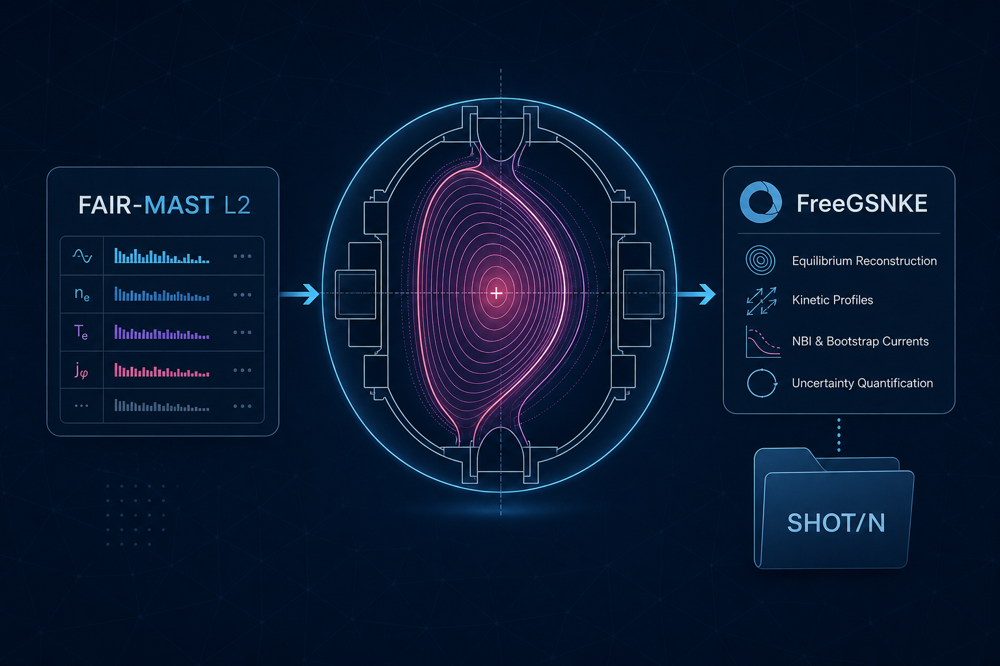
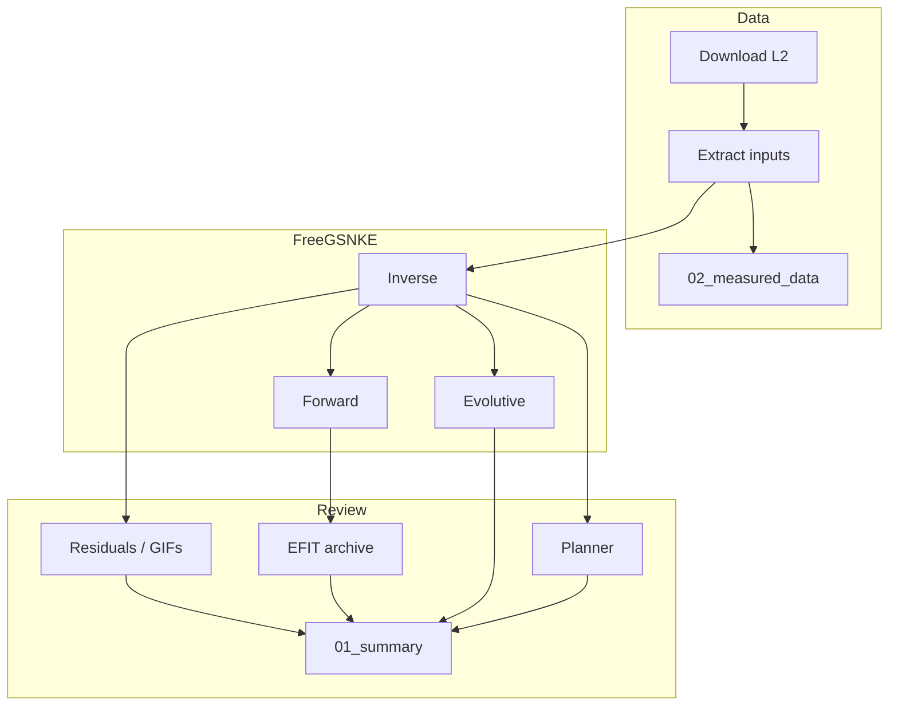
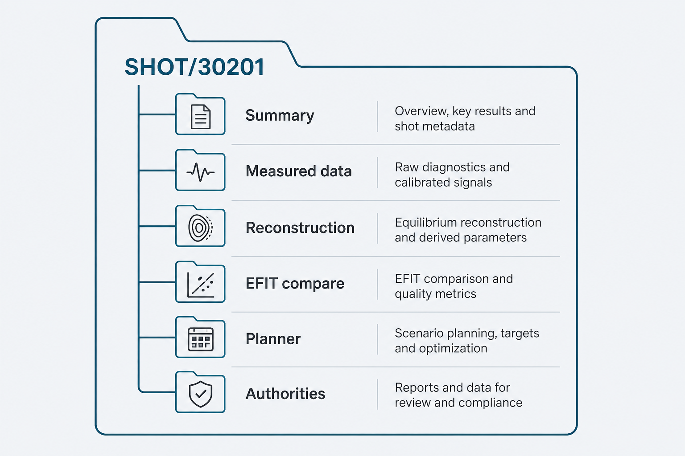

# Fair-MAST → FreeGSNKE — User Manual

**Version:** 11.34.2  
**Audience:** fusion researchers, data engineers, and reviewers who need a shot-only, authority-bound path from classic MAST Level-2 data to FreeGSNKE reconstructions  
**North star:** enter a MAST shot number; everything else is automatic  

---

## Table of contents

1. [What this software is](#1-what-this-software-is)
2. [Design laws](#2-design-laws)
3. [Install and environment](#3-install-and-environment)
4. [Shot-only happy path](#4-shot-only-happy-path)
5. [Pipeline stages in depth](#5-pipeline-stages-in-depth)
6. [The SHOT pack](#6-the-shot-pack)
7. [Authorities and contracts](#7-authorities-and-contracts)
8. [Inverse, Forward, and Evolutive honesty](#8-inverse-forward-and-evolutive-honesty)
9. [Planner and voltage map](#9-planner-and-voltage-map)
10. [EFIT archive compare and GSFit peer](#10-efit-archive-compare-and-gsfit-peer)
11. [Passives (Path B5)](#11-passives-path-b5)
12. [Browser UI](#12-browser-ui)
13. [CLI reference](#13-cli-reference)
14. [Configuration knobs](#14-configuration-knobs)
15. [Troubleshooting](#15-troubleshooting)
16. [Reviewer certification](#16-reviewer-certification)
17. [Further reading](#17-further-reading)

---

## 1. What this software is

**Fair-MAST → FreeGSNKE** converts classic MAST FAIR-MAST Level-2 archives into a reproducible FreeGSNKE equilibrium pack under `SHOT/<N>/`.

| Role | Tool |
|------|------|
| Data source | [FAIR-MAST](https://github.com/ukaea/fair-mast) / [mastapp Level-2](https://mastapp.site/level2-data.html) |
| GS solver | [FreeGSNKE](https://github.com/FusionComputingLab/freegsnke) only |
| EFIT insight | Archive compare vs FAIR-MAST `equilibrium` (ADR-002) — **not** live EFIT++ |
| Machine | Classic MAST — **not** MAST-U |

The pipeline downloads required Zarr groups, extracts PF/magnetics/geometry, resolves declared JSON authorities, generates and (by default) executes FreeGSNKE inverse/forward/evolutive scripts, scores residuals, writes plots and provenance, and optionally runs a GSPulse-method planner and an EFIT archive compare.

```text
Shot N  →  FAIR-MAST L2  →  Authorities  →  FreeGSNKE  →  SHOT/N pack
```



---

## 2. Design laws

These are non-negotiable. Violating them produces incorrect science even if the run “succeeds.”

| Law | Meaning in practice |
|-----|---------------------|
| **Determinism** | No hidden optimization, smoothing, or silent unit conventions. Same authorities + same cache → same hashes. |
| **Explicit authority** | Machine, coil map, voltage map, contracts, calibration, evolutive/planner knobs are declared JSON, snapshotted, and hashed into the run. |
| **Fail fast** | Missing or invalid authority **blocks** the run. Soft continue that invents metrology is forbidden. |
| **Do not invent geometry** | Templates must not look like real MAST probes; V→T / V→Wb factors only come from optional `diagnostic_calibration` when real factors exist. |
| **One binding coil path** | `coil_map` authority drives PF mapping. Heuristic `pf_map_rules` must not silently write production inputs. |
| **Manifest everything** | Stage outcomes land in `manifest.json` / provenance under the shot pack. |

**Implication for newcomers:** if something is awaiting a citation (e.g. classic-MAST vessel resistivity), the software will leave that physics **empty and loud**, not fill it with a convenient guess.

---

## 3. Install and environment

### Prerequisites

- **Python 3.11** for the pipeline venv and for FreeGSNKE (3.14 may lack SciPy wheels)
- Network access to the STFC Echo S3 endpoint (Level-2 download)
- Windows: recommended; Linux/macOS launchers are also shipped

### Windows (recommended)

```bat
git clone https://github.com/afshin-arj/Fair-MAST-to-FreeGSNKE-Conversion-tool.git
cd Fair-MAST-to-FreeGSNKE-Conversion-tool
setup_fresh.cmd
```

`setup_fresh.cmd` creates `.venv`, installs the package editable, bootstraps `tools/s5cmd`, and prepares `.venv-freegsnke` for FreeGSNKE execution.

### Linux / macOS

```bash
git clone https://github.com/afshin-arj/Fair-MAST-to-FreeGSNKE-Conversion-tool.git
cd Fair-MAST-to-FreeGSNKE-Conversion-tool
chmod +x setup_fresh.sh run_pipeline.sh
./setup_fresh.sh
```

### Manual install

```bash
python -m venv .venv
# Windows: .venv\Scripts\activate
# Unix:    source .venv/bin/activate
pip install -e .
pip install -e ".[ui]"    # optional Dash UI
pip install -e ".[dev]"   # pytest
```

FreeGSNKE lives in a **separate** Python 3.11 environment (default path in `configs/default.json`):

```bat
py -3.11 -m venv .venv-freegsnke
.venv-freegsnke\Scripts\python -m pip install -r requirements-freegsnke.txt
```

Point at another interpreter with `--freegsnke-python` or config key `freegsnke_python`.

### Sanity check

```bash
mast-freegsnke doctor --config configs/default.json
```

Doctor reports Python packages, s5cmd, FreeGSNKE interpreter, and key authority paths.

---

## 4. Shot-only happy path

Happy path prompts **only** for the shot number. Download, extract, machine rebuild, FreeGSNKE execute, metrics, EFIT compare, planner, and GSFit peer flags come from shipped `configs/default.json`.

### Interactive launcher

```bat
run_pipeline.cmd
```

```bash
./run_pipeline.sh
```

Enter one or more shots (space/comma separated), e.g. `30201` or `30201 30202`.

### CLI

```bash
mast-freegsnke run --shot 30201 --config configs/default.json
mast-freegsnke run --shots 30201 30202 --config configs/default.json
```

Batch mode returns the worst exit code and prints a summary. Set `batch_abort_on_failure: true` in config to stop at the first failure.

### Launcher hygiene (Windows)

| Env var | Effect |
|---------|--------|
| `RUN_PIPELINE_NO_PAUSE=1` | Skip end-of-run pause |
| `RUN_PIPELINE_SKIP_INSTALL=1` | Skip pip reinstall |
| `RUN_PIPELINE_SKIP_FREEGSNKE_ENV=1` | Skip FreeGSNKE venv ensure |

Install markers avoid redundant pip work when `pyproject.toml` is unchanged.

### Cache reuse

With `allow_cache_reuse: true` (default), non-empty `data_cache/shot_<N>/<group>.zarr` trees are reused. Fully cached required groups skip the network. Hits are recorded in the manifest `download_report`.

---

## 5. Pipeline stages in depth



| Stage | Purpose |
|-------|---------|
| **Download** | Sync required Level-2 groups (`pf_active`, `magnetics`, `wall`, …) via s5cmd |
| **Extract** | Write circuit currents/voltages, pickups, flux loops, geometry CSVs |
| **Window** | Infer formed-plasma `[t_start, t_end]` (default end policy: `ip_prepeak_floor`) |
| **Machine** | Rebuild classic-MAST FreeGSNKE pickles from FAIR-MAST + authorities when enabled |
| **Inverse** | Static Grad–Shafranov with declared shape targets |
| **Forward** | Dump-current t0 + measured PF window; live LCFS |
| **Evolutive** | nlstepper from Inverse IC + mapped voltages; soft-stop honesty |
| **Metrics** | Contract-driven residuals, optional equilibrium GIFs |
| **EFIT compare** | FreeGSNKE vs archived FAIR-MAST EFIT++ |
| **Planner** | Optional GSPulse-method Python planner (ADR-004) |
| **GSFit peer** | Optional live peer scaffold (ADR-006); soft-skips until calib + Green’s cited |
| **Summary** | Human-readable SUMMARY + science audit |

Suitability gate (`enable_shot_suitability_gate`) can exit early with a clear “unsuitable” message when Level-2 coverage is inadequate for reconstruction.

---

## 6. The SHOT pack

Every successful (or partially successful, manifested) run writes under `SHOT/<N>/` (config key `runs_dir`).



```text
SHOT/<N>/
├── 00_START_HERE.txt          # Entry point for humans
├── 01_summary/                # SUMMARY · science_audit.json
├── 02_measured_data/          # Level-2 CSV + diagnostic plots
├── 03_reconstruction/         # metrics · GIFs · evolutive · scripts
├── 04_efit_compare/           # vs EFIT++ archive
├── 06_authorities/            # snapshotted JSON + hashes
├── 07_planner/                # GSPulse-method planner outputs
├── 08_gsfit/                  # GSFit live peer (often awaiting)
└── manifest.json              # Stage outcomes + provenance
```

**How to read a pack**

1. Open `00_START_HERE.txt` and `01_summary/`.
2. Check `manifest.json` for stage status (ok / skipped / blocked / awaiting).
3. Inspect `06_authorities/` hashes if comparing two runs.
4. Use reconstruction GIFs and residual tables under `03_reconstruction/` for physics review.
5. Treat `04_efit_compare/` as **archive insight**, not a second live solver.

Do not commit large `SHOT/` trees or `data_cache/` to git unless you intentionally curate small examples.

---

## 7. Authorities and contracts

Authorities are the scientific “constitution” of a run. Defaults live under `configs/` and are snapshotted into `SHOT/<N>/06_authorities/`.

| Authority / config | Role |
|--------------------|------|
| `machine_authority/` | Classic-MAST coils, limiter, probe geometry pickles/JSON |
| `coil_map.json` | FAIR-MAST PF tokens → FreeGSNKE circuit names |
| `voltage_map.json` | Voltage channel → circuit map, signs, ohmic drive rules |
| `diagnostic_contracts.json` | Which signals participate in residual scoring |
| `diagnostic_calibration.json` | Optional real V→physical scales (never invent) |
| `shape_targets_authority.json` | Inverse shape targets |
| `evolutive_authority.json` | Evolutive stepper / soft-stop knobs |
| `profile_trajectory_authority.json` | Profile trajectory build |
| `planner_authority.json` | Planner enablement and method knobs |
| `circuit_dynamics_authority.json` | Circuit dynamics / RI terms |
| `coil_limits_authority.json` | Coil current/voltage limits for planner |
| `plasma_scalars_authority.json` | Plasma scalar targets |
| `passive_resistivity.json` | Cited ρ for Path B5 (awaiting until cited) |
| `efit_compare_authority.json` | Archive compare gates |
| `gsfit_authority.json` | GSFit peer gates (ADR-006) |
| `execution` via `default.json` | Timeouts, modes, GIF settings, cache |

**Validation helpers**

```bash
mast-freegsnke coilmap-validate --coil-map configs/coil_map.json
mast-freegsnke contracts-validate --contracts configs/diagnostic_contracts.json
mast-freegsnke machine-validate --machine-authority machine_authority
```

Missing required authority → blocking error with a fix hint. That is intentional.

---

## 8. Inverse, Forward, and Evolutive honesty

Three FreeGSNKE modes answer different questions. Do not conflate their LCFS or stop criteria.

| Mode | Initial / drive | What “success” means |
|------|-----------------|----------------------|
| **Inverse** | Static GS; declared shape targets | Shape gate ≠ FreeGSNKE GS numerical stop |
| **Forward** | Dump-current t0 + measured PF currents in window | Live LCFS; not the same as Inverse DN |
| **Evolutive** | Inverse IC + mapped voltages via nlstepper | Live LCFS; soft-stop (e.g. axis drift) is **honest** under `n_passive=0` |

**Why evolutive may soft-stop early:** without cited vessel passives, the active-only circuit model cannot capture eddy-current screening. Soft-stop + loud notes are correct science communication, not a mapping bug.

**Shape gate vs solver stop:** Inverse may report shape residuals separately from FreeGSNKE’s internal GS convergence. Read both in the summary/science audit.

---

## 9. Planner and voltage map

### Planner (ADR-004)

When `execute_planner: true`, a Phase 2b **Python** GSPulse-method planner writes `07_planner/` (isoflux / Picard / ψ_bry style methods — **no MATLAB**). Passives remain blocked until Path B5 resistivity is cited; planner status stays YELLOW on that axis.

### Voltage map

`configs/voltage_map.json` binds Level-2 (and declared L1 inventory where used) voltage channels to FreeGSNKE circuits with explicit **signs**.

Science notes for v11.34:

- **P4/P5** use `sign = −1` so `corr(V, dI/dt) > 0` under FreeGSNKE current polarity.
- **Solenoid** remains `sign = +1`.
- Solenoid ΔV gaps are treated as **same-sign active-only model gaps** (not a p1 sign flip): early bias is larger under high `|dI/dt|`.
- **P3/P6** may use declared `I×R` ohmic drive when public PF voltages are absent — always via authority, never silent invention.

Annex plots and gap labels (bias, RI, L dI/dt, same-sign honesty) live under planner / reconstruction science outputs when enabled.

---

## 10. EFIT archive compare and GSFit peer

### EFIT (ADR-002)

`compare_efit_archive: true` compares FreeGSNKE outputs to FAIR-MAST Level-2 **archived** EFIT++ fields. This is Windows-friendly insight, **not** a live EFIT++ / Py-EFIT / efit-ai run (ADR-003 rejects those on the happy path).

### GSFit (ADR-006)

`execute_gsfit: true` runs an authority-gated **live peer** scaffold. Until calibration factors and Green’s functions are cited, the stage **soft-skips** and records awaiting status. Empty peer folders with clear notes beat invented metrology.

---

## 11. Passives (Path B5)

Classic MAST Level-2 `pf_passive` publishes parallelogram geometry for vessel structures but **does not** publish resistivity. FreeGSNKE `passive_coils.pickle` requires ρ (Ω·m).

Per ADR-005:

1. Do **not** invent classic-MAST ρ.
2. Do **not** copy MAST-U / FUSE / FreeGSNKE MAST-U passives onto classic MAST.
3. Populate `configs/passive_resistivity.json` only with published values and a `source` citation.
4. Until then: empty passives, certify warning `passive_resistivity_awaiting_authority`, planner notes exclusion, evolutive soft-stop stays loud.

Literature that documents **method** (VALEN / CREATE-L eddy models) is not a paste-ready ρ table. See `docs/adr/005-classic-mast-passive-resistivity.md`.

---

## 12. Browser UI

```bat
run_ui.cmd
```

```bash
mast-freegsnke ui --config configs/default.json
```

Default: `http://127.0.0.1:8050`  
Requires `pip install -e ".[ui]"`.

The UI is shot-only: run a shot, browse existing `SHOT/<N>/` packs, and inspect summary/reconstruction tabs. It does not invent authorities; it drives the same pipeline config as the CLI.

---

## 13. CLI reference

Core happy-path commands:

| Command | Purpose |
|---------|---------|
| `doctor` | Environment prerequisites |
| `check` | Level-2 group availability (no download) |
| `run` | Full pipeline (`--shot` or `--shots`) |
| `ui` | Dash UI |
| `window` / `windowqc` / `consensus` | Recompute window / QC / multi-signal consensus |
| `plan` | Planner-focused entry (see `--help`) |
| `certify-run` | Reviewer-grade pack + optional replay |
| `coilmap-validate` / `contracts-validate` / `machine-validate` | Authority validation |
| `geom-template` / `geom-validate` / `geom-smoke` | Probe geometry tooling |
| `reviewer-pack` | Self-contained reviewer export |
| `robustness-run` / `robustness-pack` | Multi-window robustness (v4) |
| `physics-audit-run` / `physics-audit-pack` | Physics consistency (v6) |
| `model-form-run` / `forward-check-run` / `consistency-pack` | Model-form / Consistency Triangle (v7) |
| `replay-run` / `forensic-compare` / `nondeterminism-check` | Hash/replay forensics (v8) |
| `corpus-build` / `atlas-build` / `compare-run` / `regression-guard` | Cross-shot corpus (v5) |
| `closure-atlas-build` | Corpus-level closure atlas |

Always pass `--config configs/default.json` (or your fork) for config-bearing commands. Use `mast-freegsnke <cmd> --help` for full flags.

**Common `run` overrides**

```bash
mast-freegsnke run --shot 30201 --config configs/default.json \
  --tstart 0.20 --tend 0.35 \
  --freegsnke-mode both \
  --freegsnke-python .venv-freegsnke/Scripts/python.exe
```

---

## 14. Configuration knobs

Primary file: `configs/default.json`.

| Key | Default intent |
|-----|----------------|
| `required_groups` | `pf_active`, `magnetics`, `wall` |
| `window_end_policy` | `ip_prepeak_floor` |
| `execute_freegsnke` | `true` |
| `freegsnke_run_mode` | `both` (inverse + forward) |
| `execute_evolutive` | `true` |
| `execute_planner` | `true` |
| `compare_efit_archive` | `true` |
| `execute_gsfit` | `true` (soft-skips if awaiting) |
| `require_machine_authority` | `true` |
| `rebuild_machine_authority` | `true` |
| `allow_cache_reuse` | `true` |
| `enable_contract_metrics` | `true` |
| `enable_experimental_data` | `true` |
| `metrics_n_times` | sample count for residual time grid |
| `export_torax_geometry` | `false` (ADR-001 optional) |

Change authorities by editing the referenced JSON paths — do not embed silent heuristics in scripts.

---

## 15. Troubleshooting

| Symptom | Likely cause | Fix |
|---------|--------------|-----|
| Doctor fails on FreeGSNKE | Missing / wrong Python | Rebuild `.venv-freegsnke` with 3.11; set `freegsnke_python` |
| Download timeouts | Network / s5cmd | Run `python scripts/ensure_s5cmd.py`; check `s3_endpoint_url` |
| Blocking “missing authority” | Required JSON / machine dir absent | Follow error hint; validate with `*-validate` commands |
| Empty passives / soft-stop | Path B5 awaiting ρ | Expected until ADR-005 citation; do not invent |
| GSFit skipped | ADR-006 awaiting calib/Green’s | Expected; inspect `08_gsfit/` notes |
| Unsuitable shot exit | Suitability gate | Read message; choose another shot or relax only with science justification |
| Cache confusion | Stale `data_cache` | Delete `data_cache/shot_<N>/` for a clean re-sync |
| Windows console closes | Launcher pause skipped | Unset `RUN_PIPELINE_NO_PAUSE` |

For a failed pack, start at `manifest.json` and `01_summary/`, then the failing stage directory. The `run-doctor` agent role / skill is intended for structured diagnosis of `SHOT/<N>/`.

---

## 16. Reviewer certification

After a completed run:

```bash
mast-freegsnke certify-run --shot 30201 --config configs/default.json
# or
mast-freegsnke reviewer-pack --run SHOT/30201
mast-freegsnke replay-run --target SHOT/30201 --mode strict
```

Certification checks authority snapshots, hashes, and (unless skipped) replay closure. Use forensic compare when two packs disagree:

```bash
mast-freegsnke forensic-compare --A SHOT/30201 --B SHOT/30202 --out ./forensics
```

---

## 17. Further reading

| Document | Contents |
|----------|----------|
| [README.md](../README.md) | Quick start + graphics |
| [AGENTS.md](../AGENTS.md) | North star, agent roles, design laws |
| [HOW_TO_RUN.txt](../HOW_TO_RUN.txt) | Launcher / CLI cheat sheet |
| [docs/adr/](adr/README.md) | Architecture Decision Records |
| ADR-001 | Optional TORAX GEQDSK export |
| ADR-002 | FAIR-MAST EFIT++ archive compare |
| ADR-003 | Reject Py-EFIT / efit-ai on Windows happy path |
| ADR-004 | Profile trajectory + planner |
| ADR-005 | Classic-MAST passive resistivity (Path B5) |
| ADR-006 | GSFit live peer scaffold |

Upstream: [FAIR-MAST](https://github.com/ukaea/fair-mast) · [FreeGSNKE](https://github.com/FusionComputingLab/freegsnke) · [mastapp Level-2](https://mastapp.site/level2-data.html)

---

© 2026 Afshin Arjhangmehr — Fair-MAST → FreeGSNKE
